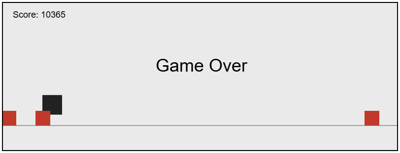
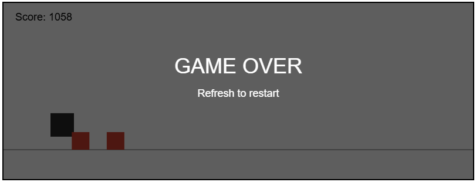
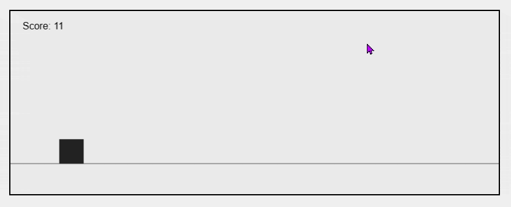

# 🏃 Endless Runner 2D – JavaScript Canvas Game

A small 2D endless runner game built with **vanilla JavaScript** and **HTML5 Canvas**.  
The goal is to survive as long as possible by avoiding incoming obstacles while the game gradually increases in difficulty.

This project was developed as a **portfolio piece** to demonstrate core game development concepts using JavaScript.

---

## 🎮 Gameplay

- The player runs automatically
- Press **Space** or **Click / Tap** to jump
- Avoid incoming obstacles
- Game speed and difficulty increase over time
- The score increases the longer you survive

When you collide with an obstacle, the game ends.  
Tap or click the screen to restart.

---

## ✨ Features

- Custom game loop using `requestAnimationFrame`
- Gravity-based jump physics
- Collision detection (AABB)
- Dynamic difficulty scaling:
  - Increasing obstacle speed
  - Randomized obstacle spawn timing
- Time-based score system
- Clean **Game Over overlay** rendered directly on canvas
- Restart without page refresh
- No external libraries

---

## 🛠 Tech Stack

- **JavaScript (ES6)**
- **HTML5 Canvas**
- **CSS (minimal)**

---

## 📸 Screenshots

---

## 🚀 How to Run the Game

1. Clone the repository:

- https://github.com/ghostmaruko/Endless-Runner

2. Open `index.html` in your browser

No build tools or dependencies required.

---

## 📚 What This Project Demonstrates

- Understanding of game loops and real-time updates
- Physics simulation basics (gravity and jumping)
- Object-oriented game architecture
- Obstacle spawning and cleanup
- Scalable difficulty progression
- Clean and readable JavaScript code

---

## 📱 Responsive Design

The game is fully playable on **desktop and mobile devices**.  
It supports mouse, keyboard, and touch input for a consistent experience across platforms.
